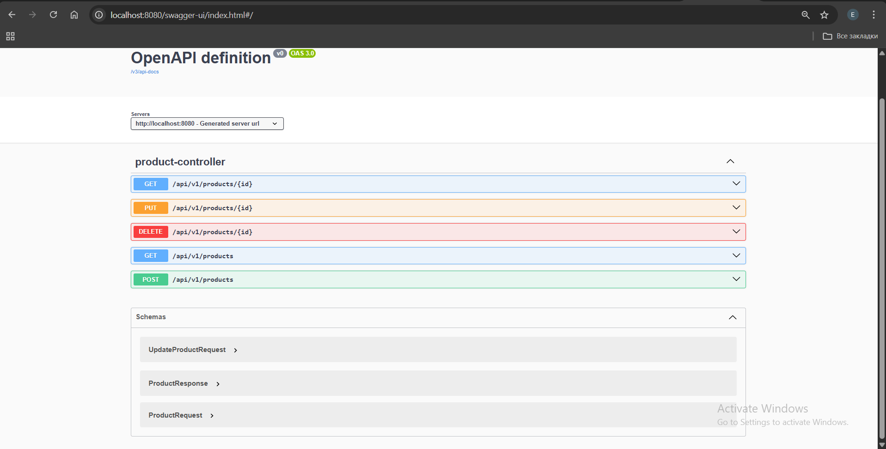
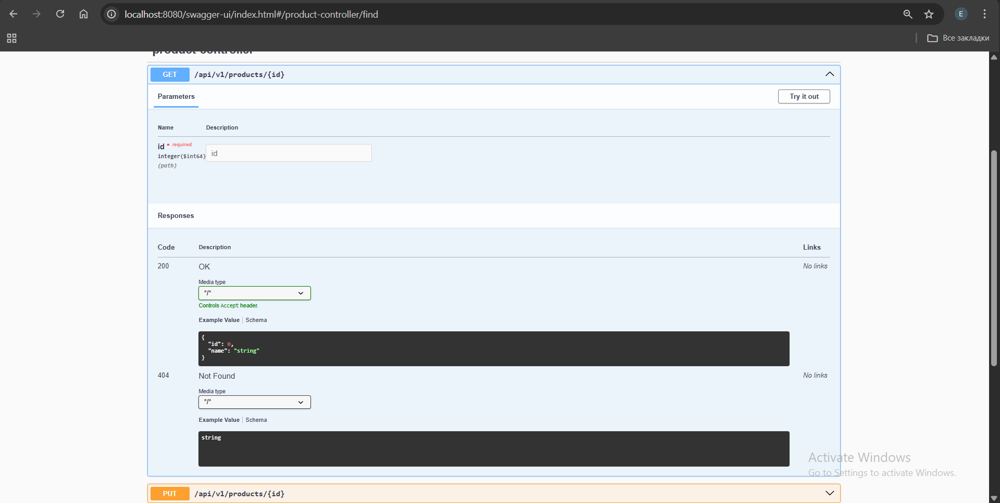
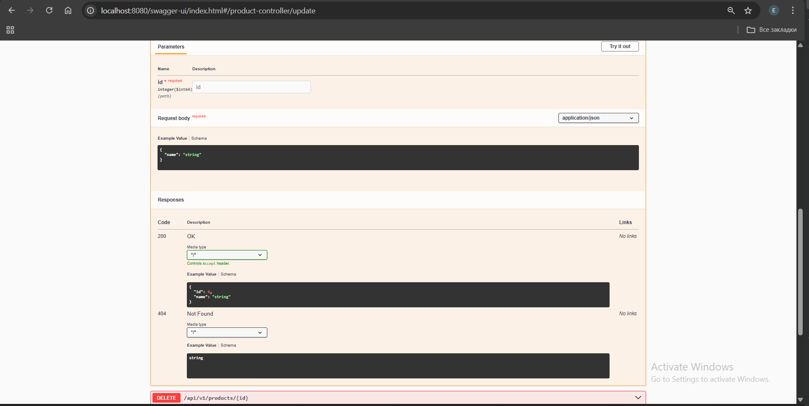
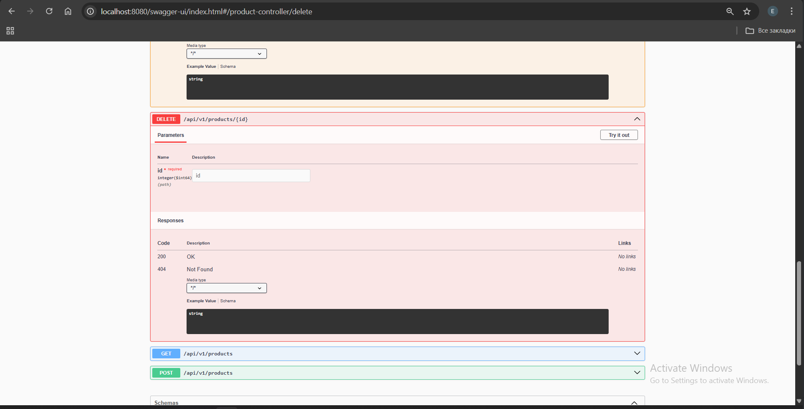
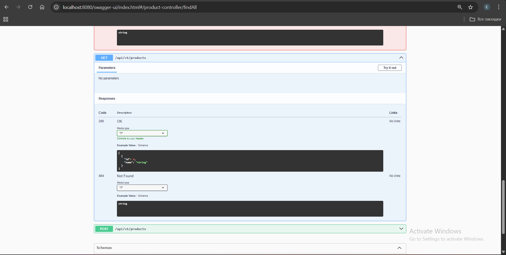
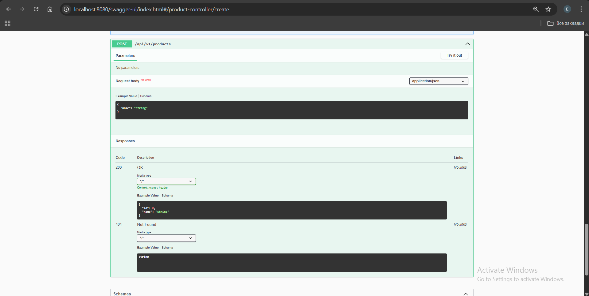

# Project 2 – REST API

## Use Cases (Swagger UI)

### 1. OpenAPI overview

### 2. Get product by ID

### 3. Update product

### 4. Delete product

### 5. Get all products

### 6. Create product
